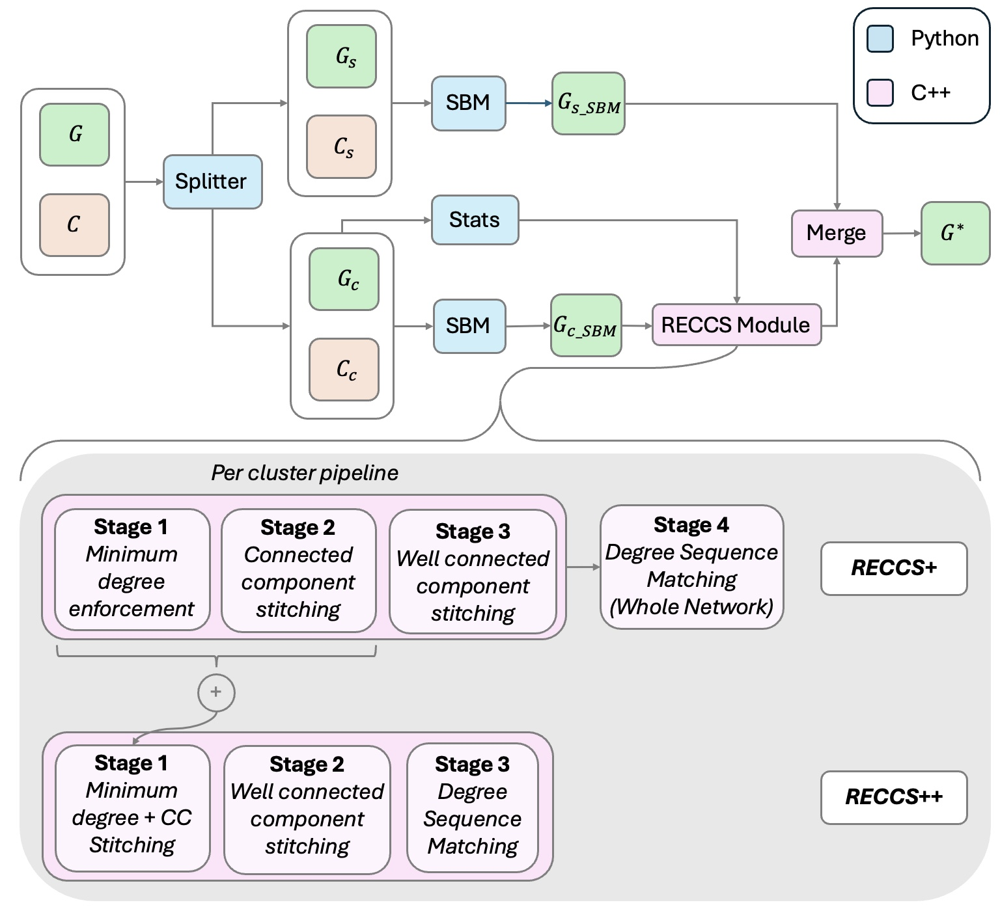

# RECCS++

**Scalable REalistic Cluster Connectivity Simulator for synthetic network generation**



## 🛠️ Requirements

- **cmake** (3.26.5+)
- **gcc/g++** (11.4.1+)
- **python** (3.13.2+) *for graph-tool*
- **conda** (24.9.2+) *for graph-tool*
- **openmp** (201511+)

## 🚀 Installation

### 1. Install Dependencies

Set up and load the `graph-tool` conda environment:

```bash
source install.sh
```

### 2. Build RECCS

Compile the project:

```bash
mkdir build
cd build
cmake .. && make
```

### 3. Verify Installation

Test that RECCS built successfully:

```bash
./eval/eval_pipeline_mini.sh
```

### 4. Initiate Pre-Commit Hook (For UIUC Campus Cluster Development Only)

Run this command in the terminal with your conda env active:

```bash
pre-commit install
```

This will run automated tests before you commit any changes to Python or C++ files

## 📖 Usage

RECCS++ provides two executables with different algorithmic approaches:

- **`./reccspp`** - RECCS++ with full algorithmic speedups and PP-style degree sequence matching
- **`./reccs`** - RECCS+ with full algorithmic fidelity to original RECCS

Both executables support two modes: **Normal mode** (runs full pipeline) and **Checkpoint mode** (skips orchestrator using pre-generated files).

### Quick Start

**RECCS++ (recommended for speed):**

```bash
./reccspp graph.tsv -c clusters.tsv -v
```

**RECCS+ (for algorithmic fidelity):**

```bash
./reccs graph.tsv -c clusters.tsv -v
```

**Checkpoint mode:**

```bash
./reccspp --checkpoint -c clusters.tsv \
  --clustered-sbm clustered.tsv --unclustered-sbm unclustered.tsv \
  --requirements requirements.csv --degseq degseq.json \
  --deficits deficits.json -v
```

### Command Line Reference

#### RECCS++ (`./reccspp`)

```text
Usage: ./reccspp <edgelist.tsv> [options]
       ./reccspp --checkpoint [checkpoint_options]

Note: In normal mode, <edgelist.tsv> must be the first argument.
      In checkpoint mode, --checkpoint must be the first argument.

Common options:
  -c <clusters.tsv> Load clusters from TSV file (required)
  -t <num_threads>  Number of threads to use (default: hardware concurrency)
  -v                Verbose mode: print detailed progress information
  -o <output_file>  Output file (default: 'output.tsv')
  -h, --help        Show this help message and exit

Normal mode specific options:
  <edgelist.tsv>                   Input graph edgelist file

Checkpoint mode specific options:
  --checkpoint                     Enable checkpoint mode (skip orchestrator)
  --clustered-sbm <path>          Path to clustered SBM graph file
  --unclustered-sbm <path>        Path to unclustered SBM graph file
  --requirements <path>           Path to requirements CSV file
  --degseq <path>                 Path to degree sequence JSON file
  --deficits <path>               Path to degree deficits JSON file
```

#### RECCS+ (`./reccs`)

```text
Usage: ./reccs <edgelist.tsv> [options]
       ./reccs --checkpoint [checkpoint_options]

Note: In normal mode, <edgelist.tsv> must be the first argument.
      In checkpoint mode, --checkpoint must be the first argument.

Common options:
  -c <clusters.tsv>   Load clusters from TSV file (required)
  -t <num_threads>    Number of threads to use (default: hardware concurrency)
  -v                  Verbose mode: print detailed progress information
  -o <output_file>    Output file (default: 'output.tsv')
  -h, --help          Show this help message and exit
  --v2                Use V2 degree sequence fitting with SBM
  --cleanup           Clean up temporary files after execution
  --tempname <name>   Use a custom temporary directory name (default: 'temp{timestamp}')

Normal mode specific options:
  <edgelist.tsv>                   Input graph edgelist file (used as empirical graph)

Checkpoint mode specific options:
  --checkpoint                    Enable checkpoint mode (skip orchestrator)
  --clustered-subgraph <path>     Path to the empirical clustered subgraph file
  --clustered-sbm <path>          Path to clustered SBM graph file
  --unclustered-sbm <path>        Path to unclustered SBM graph file
  --requirements <path>           Path to requirements CSV file
  --deficits <path>               Path to degree deficits JSON file (default: 'degree_deficits.json')
```

### Modes Explained

#### Normal Mode

Runs the complete RECCS pipeline starting from a graph edgelist and clustering file. The orchestrator will generate all intermediate files and process the graph through the full workflow.

**Use when:**

- Running RECCS for the first time
- You have a raw graph and clustering that need processing
- You want the complete pipeline execution

#### Checkpoint Mode

Skips the orchestrator and loads pre-generated intermediate files directly. This is useful for:

**Use when:**

- Resuming interrupted processing
- Re-running analysis with different parameters on the same intermediate data
- You already have the required intermediate files from a previous run

**Required checkpoint files for RECCS++:**

- Clustered SBM graph file (`--clustered-sbm`)
- Unclustered SBM graph file (`--unclustered-sbm`)
- Requirements CSV file (`--requirements`)
- Degree sequence JSON file (`--degseq`)
- Degree deficits JSON file (`--deficits`)

**Required checkpoint files for RECCS+:**

- Clustered subgraph file (`--clustered-subgraph`)
- Clustered SBM graph file (`--clustered-sbm`)
- Unclustered SBM graph file (`--unclustered-sbm`)
- Requirements CSV file (`--requirements`)
- Degree deficits JSON file (`--deficits`)

### Examples

**Complete pipeline with RECCS++ (verbose output):**

```bash
./reccspp input/network.tsv -c input/clusters.tsv -t 8 -v -o results.tsv
```

**Complete pipeline with RECCS+ (algorithmic fidelity):**

```bash
./reccs input/network.tsv -c input/clusters.tsv -t 8 -v -o results.tsv
```

**RECCS+ with V2 degree sequence fitting:**

```bash
./reccs input/network.tsv -c input/clusters.tsv --v2 -v -o results.tsv
```

**Resume from checkpoint files (RECCS++):**

```bash
./reccspp --checkpoint -c input/clusters.tsv \
  --clustered-sbm temp123/clustered_sbm/syn_sbm.tsv \
  --unclustered-sbm temp123/unclustered_sbm/syn_sbm.tsv \
  --requirements temp123/clustered_stats.csv \
  --degseq temp123/clustered_stats_degree_sequences.json \
  --deficits temp123/degree_deficits.json \
  -v -o final_output.tsv
```

**Resume from checkpoint files (RECCS+):**

```bash
./reccs --checkpoint -c input/clusters.tsv \
  --clustered-subgraph temp123/non_singleton_edges.tsv \
  --clustered-sbm temp123/clustered_sbm/syn_sbm.tsv \
  --unclustered-sbm temp123/unclustered_sbm/syn_sbm.tsv \
  --requirements temp123/clustered_stats.csv \
  --deficits temp123/degree_deficits.json \
  -v -o final_output.tsv
```

**Multi-threaded processing:**

```bash
./reccspp graph.tsv -c clusters.tsv -t 16 -o output.tsv
```

**Custom temporary directory with cleanup:**

```bash
./reccs graph.tsv -c clusters.tsv --tempname my_temp --cleanup -v
```
